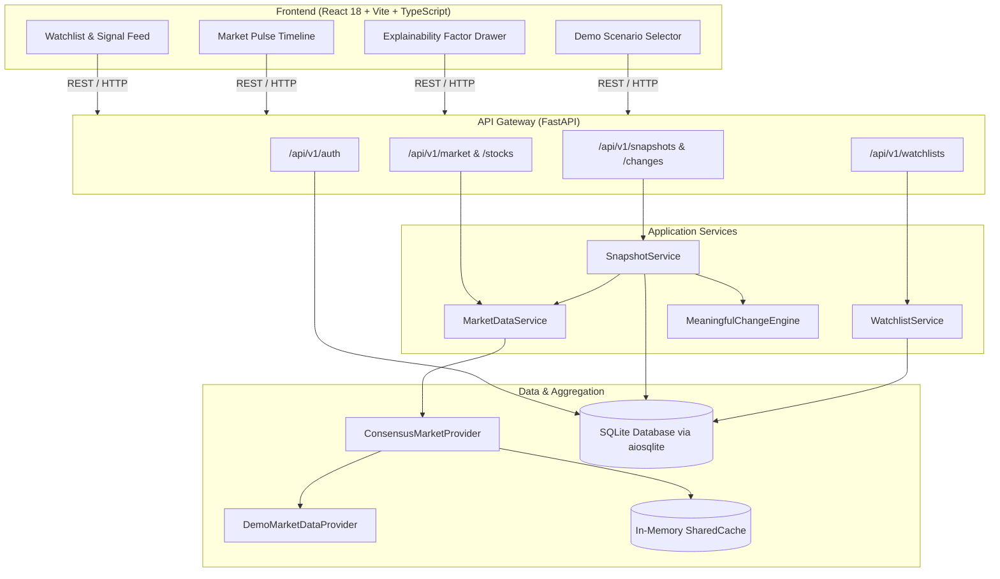

# FLUX — KNOW WHAT CHANGED.
> **Understand the movement.**

FLUX is an intelligent market watchlist engine designed to surface meaningful market shifts rather than overwhelming users with raw ticker noise. By comparing current market conditions against a user's previous check-in snapshot, FLUX isolates notable price velocity, unusual volume anomalies, volatility breaches, and critical price extremes into ranked, explainable signals.

*Built for the Code by Groww 2026 engineering challenge.*

---

## Overview

### The Problem
Traditional market watchlists operate as raw data displays. They present rows of current prices and fixed 24-hour percentage changes without context. For a user returning after two hours or three days, standard percent-change metrics fail to answer the most critical questions:
- *What changed since I last looked?*
- *Is this movement routine market chop or an actual momentum shift?*
- *Which stocks in my watchlist actually require my attention right now?*

### The FLUX Approach
FLUX shifts the focus from continuous observation to stateful session comparison:
1. **User Baseline Snapshots**: Every check-in captures the exact market state of the user's watchlist stocks.
2. **Session-to-Session Delta**: When the user returns, current quotes are evaluated directly against their prior personal baseline rather than an arbitrary 24-hour window.
3. **Multi-Factor Meaningful Change Engine**: Movements are scored across five distinct dimensions (price velocity, volume ratio, volatility multiples, price-level boundaries, and confluence) to separate true signals from routine fluctuations.
4. **Explainable Insights**: Every alert is paired with a quantitative factor breakdown and concise summary explaining why the movement was flagged.

---

## Key Features

- **Custom Watchlist Management**: Create and organize multiple watchlists, reorder entries, and toggle priority flags per symbol.
- **Stateful Baseline Snapshots**: Freezes watchlist quotes upon each user check-in to compute true personal delta over time.
- **Meaningful Change Detection**: Algorithmic scoring model that suppresses noise below a configurable threshold and ranks changes by significance.
- **Categorized Severity Tiers**: Signals classified into `NORMAL`, `MODERATE`, `HIGH`, and `CRITICAL` with visual 1–5 level meters.
- **Transparent Factor Breakdown**: Detailed scoring decomposition covering price velocity, volume multiples, volatility bands, and 52-week proximity.
- **Market Pulse Timeline**: Chronological tracking of notable intraday inflection points throughout trading hours.
- **Market Session Status**: Live indicator for market state (Open/Closed), active exchange (NSE), and current session timing.
- **Data Freshness Indicators**: Explicit classification tags (`LIVE`, `RECENT`, `STALE`, `UNAVAILABLE`) reflecting provider latency.
- **Resilient Multi-Provider Handling**: Fallback aggregation that handles provider timeouts, missing symbols, and cross-provider price conflicts.
- **Deterministic Demo Scenarios**: Built-in test scenarios (surges, market pullbacks, stale data, provider failures) for repeatable local evaluation.
- **JWT Authentication**: Secure user registration, login, and session persistence across client devices.

---

## How It Works

```
┌─────────────────┐       ┌────────────────────────┐       ┌──────────────────────┐
│  User Check-In  │ ────> │ Capture Baseline State │ ────> │ Stores Snapshot in   │
│                 │       │ (Prices, Volume, 52W)  │       │ Database (User-tied) │
└─────────────────┘       └────────────────────────┘       └──────────────────────┘
                                                                       │
                                   User returns later                  │
                                                                       ▼
┌─────────────────┐       ┌────────────────────────┐       ┌──────────────────────┐
│ Ranked Signals  │ <──── │ Meaningful Change      │ <──── │ Fetch Current Market │
│ & Explanations  │       │ Scoring Engine         │       │ Quotes via Provider  │
└─────────────────┘       └────────────────────────┘       └──────────────────────┘
```

1. **First Visit**: An initial baseline snapshot is recorded for the user's watchlist symbols without generating false or fabricated alerts.
2. **Subsequent Visits**: The system queries current quotes for all tracked symbols, retrieves the user's most recent snapshot, and computes the delta vector for each stock.
3. **Evaluation**: The **Meaningful Change Engine** scores each stock against baseline thresholds.
4. **Presentation**: Results are sorted descending by composite significance score, displaying prioritized change cards with editorial commentary and factor scores.

---

## Meaningful Change Engine

The core scoring engine is decoupled from storage and presentation logic. It evaluates market deltas through a composite mathematical model yielding a normalized score between `0.0` and `1.0`:

$$\text{Composite Score} = w_p S_p + w_v S_v + w_\sigma S_\sigma + w_l S_l + w_c S_c$$

### Implemented Factors & Weights

| Factor | Weight ($w$) | Metric Evaluated | Implementation Logic |
| :--- | :---: | :--- | :--- |
| **Price Velocity ($S_p$)** | **0.35** | Absolute % price change vs. baseline | Suppressed below **0.4%** (noise floor). Scaled linearly between **2.0%** (notable), **4.0%** (significant), and **6.0%+** (extreme). |
| **Volume Anomaly ($S_v$)** | **0.25** | Current volume vs. typical daily volume | Evaluates ratio against baseline average. Triggers at **1.5×** (notable), **2.2×** (high), and **3.5×** (extreme volume surge). |
| **Volatility Deviation ($S_\sigma$)** | **0.15** | Move divided by typical volatility band | Measures whether the price move exceeds **1.25×** the stock's typical session volatility / ATR band. |
| **Price Level Proximity ($S_l$)** | **0.15** | 52-week High/Low boundaries & Gap-opens | Awards maximum score for new 52W record breaks, elevated score within **1.5%** of boundary, or opening gaps $\ge \mathbf{2.0\%}$. |
| **Contextual Confluence ($S_c$)** | **0.10** | Co-occurrence of independent signals | Bonus awarded when 2 or more factors trigger simultaneously (compound movement). |

### Severity Classification

Based on the composite score, changes are categorized into four operational tiers:

| Severity Tier | Composite Score Cutoff | Signal Meter | Treatment in UI |
| :--- | :---: | :---: | :--- |
| **CRITICAL** | $\ge 0.80$ | `● ● ● ● ●` | Highlighted as primary alert; high price velocity with anomalous volume. |
| **HIGH** | $\ge 0.60$ | `● ● ● ● ○` | Significant directional catalyst or 52-week breakout boundary. |
| **MODERATE** | $\ge 0.35$ | `● ● ● ○ ○` | Activity noticeably above normal daily variance. |
| **NORMAL** | $< 0.35$ | `● ● ○ ○ ○` | Routine market movement; filtered from priority view by default. |

---

## Architecture

FLUX is organized as a modular application with clean separation of concerns:



- **Client Layer**: Single Page Application built with React 18, TypeScript, and Vite, utilizing Tailwind CSS and Lucide React.
- **API Gateway**: Asynchronous FastAPI endpoints with CORS middleware, Pydantic v2 validation, and JWT authentication.
- **Service Layer**: Decoupled domain services isolating business logic (`SnapshotService`, `WatchlistService`, `MarketDataService`).
- **Engine**: Pure algorithmic evaluation with zero external database or HTTP dependencies.
- **Data Access**: Asynchronous SQLAlchemy 2.0 interface with SQLite (`aiosqlite`) and an in-memory TTL cache.

---

## Data & State

### Database Models
The relational schema is managed through SQLAlchemy models:
- **`User`**: Account identity, hashed credentials, user role, and activity counters.
- **`Watchlist`**: User-owned watchlists with positioning and default flags.
- **`WatchlistStock`**: Join table mapping stocks to watchlists with an `is_priority` flag. Enforces a database-level unique constraint (`uq_watchlist_stock`) to prevent duplicate additions.
- **`Stock`**: Master stock directory containing reference baselines (52W high/low, typical daily volume, typical volatility %).
- **`MarketSnapshot`**: Records check-in metadata, timestamp, and meaningful change counts for a user (`ix_user_created_at` index).
- **`StockSnapshot`**: Frozen price, volume, and boundary values for each stock captured during a snapshot (`uq_snapshot_stock` unique constraint).
- **`MarketEvent` & `UserEvent`**: Historic log of detected signals and user interactions (read/bookmarked).

### Session & Cross-Device Persistence
- User state is stored server-side and accessed via Bearer JWT tokens.
- Snapshots are persistent in the database rather than local client storage, ensuring consistent baseline comparisons whether a user logs in from desktop or mobile.

---

## Market Data Reliability

Market data ingestion is designed around provider abstraction to maintain system stability:

```
                  ┌───────────────────────────────┐
                  │    ConsensusMarketProvider    │
                  └──────────────┬────────────────┘
                                 │
                 ┌───────────────┴───────────────┐
                 ▼                               ▼
    ┌─────────────────────────┐     ┌─────────────────────────┐
    │    Primary Provider     │     │   Secondary Provider    │
    │  (Attempts real-time)   │     │    (Graceful Fallback)  │
    └─────────────────────────┘     └─────────────────────────┘
```

1. **Provider Abstraction**: All market feeds adhere to the `MarketDataProvider` abstract interface, allowing pluggable data sources.
2. **Freshness Tracking**: Every quote is stamped with a `FreshnessStatus`:
   - `LIVE`: Data refreshed within the last 15 seconds.
   - `RECENT`: Data refreshed within the last 5 minutes.
   - `STALE`: Data older than 15 minutes (displays an explicit UI warning banner).
   - `UNAVAILABLE`: Data feed unreachable.
3. **Multi-Provider Fallback**: The `ConsensusMarketProvider` attempts queries via primary feeds; if timeouts or exceptions occur, it fails over to secondary providers.
4. **Discrepancy Arbitration**: If concurrent provider quotes for the same symbol diverge by more than **0.5%**, the system logs an anomaly warning and arbitrates based on timestamp freshness.
5. **Fail-Safe Containment**: If all providers fail, the service returns an explicit `UNAVAILABLE` quote structure with descriptive failure context rather than raising unhandled 500 errors.

---

## Resilience & Edge Cases

The codebase includes explicit handling for common operational edge cases:

- **First-Time Users**: Initial check-in creates a baseline snapshot without generating phantom change alerts.
- **Market Closed**: The system inspects market hours (`09:15` to `15:30` IST) and surfaces the official session status to clarify static price behavior.
- **Duplicate Additions**: Handled both in application validation and via the `uq_watchlist_stock` database unique constraint.
- **Provider Timeouts**: Caught within the provider abstraction, returning fallback values without breaking the user session.
- **Stale Feed Warning**: Automatically alerts the user when incoming quotes exceed the freshness window.
- **Concurrent Ingestion**: Thread-safe shared caching primitives prevent redundant concurrent network roundtrips for identical symbols.

---

## Scalability Considerations

FLUX incorporates several architectural optimizations to sustain larger user and watchlist volumes:

- **Shared In-Memory Cache with TTL**: In-memory caching with a 10-second TTL (`app/core/cache.py`) serves popular symbols across all user watchlists from a single upstream fetch, eliminating redundant queries.
- **Batch Processing**: The service layer uses batch operations (`get_quotes_batch` and `get_multi`) to fetch quote sets in bulk rather than executing individual queries per stock.
- **Asynchronous Non-Blocking I/O**: The entire backend pipeline—from FastAPI route handlers to SQLAlchemy database operations via `aiosqlite`—is asynchronous, allowing worker threads to remain non-blocked during database and provider queries.
- **Database Indexing**: Targeted indexing on foreign keys (`user_id`, `watchlist_id`, `snapshot_id`) and chronological compound indexes (`ix_user_created_at`) optimize snapshot retrieval for high-volume users.

---

## Security

- **Password Security**: Passwords hashed using bcrypt through `passlib.context.CryptContext`.
- **Stateless Authentication**: Cryptographically signed JSON Web Tokens (PyJWT) using HMAC-SHA256 (`HS256`).
- **Endpoint Authorization**: Route protection via FastAPI dependencies (`get_current_user`) verifying token integrity.
- **Input Validation**: Strict request/response payload validation through Pydantic v2 schemas.
- **CORS Protection**: Explicitly configured `CORSMiddleware` restricting origins, allowed headers, and methods.
- **Config Management**: Environment variable isolation managed via `pydantic-settings` with local `.env` overrides.

---

## Tech Stack

### Frontend
- **Framework**: React 18 (TypeScript)
- **Tooling**: Vite, PostCSS, Autoprefixer
- **Styling**: Tailwind CSS
- **Charts & Visualization**: Recharts
- **Icons**: Lucide React

### Backend
- **Framework**: FastAPI (Python 3.10+)
- **ASGI Server**: Uvicorn
- **ORM & Database**: SQLAlchemy 2.0 (Async), aiosqlite, SQLite
- **Validation**: Pydantic v2, Pydantic Settings
- **Authentication**: PyJWT, passlib, bcrypt
- **HTTP Client**: HTTPX

### Testing & Tooling
- **Testing**: pytest, pytest-asyncio
- **Process & Dev**: Git, npm, pip

---

## Project Structure

```
Flux/
├── backend/
│   ├── app/
│   │   ├── api/v1/              # API Route Controllers (auth, watchlists, changes, market, stocks)
│   │   ├── core/                # Config, logging, JWT security, in-memory cache
│   │   ├── db/                  # Relational models, connection setup, database seed
│   │   ├── engine/              # MeaningfulChangeEngine & transparent factor breakdown
│   │   ├── services/            # SnapshotService, WatchlistService, MarketDataService
│   │   └── main.py              # Application entrypoint & FastAPI lifespan
│   ├── tests/                   # Automated unit, integration, and resilience tests
│   ├── requirements.txt         # Python dependencies
│   └── test_e2e_verify.py       # End-to-end integration test runner
│
├── frontend/
│   ├── src/
│   │   ├── components/
│   │   │   ├── cards/           # Change cards & explainability drawers
│   │   │   ├── changes/         # Changes feed & filter controls
│   │   │   ├── common/          # Badges, meters, banners, skyline art
│   │   │   ├── demo/            # Interactive scenario control bar
│   │   │   ├── engine/          # System specs & threshold documentation view
│   │   │   ├── hero/            # Editorial dashboard hero & summary
│   │   │   ├── layout/          # Navigation header & sidebar
│   │   │   ├── pulse/           # Market Pulse chronological timeline
│   │   │   ├── stock/           # Stock detail modal & candlestick charts
│   │   │   └── watchlist/       # Watchlist table, tabs, and stock management
│   │   ├── context/             # Auth, Market, Watchlist, and Mission contexts
│   │   ├── services/api.ts      # Typed API client with token storage
│   │   ├── types/               # TypeScript interfaces and data models
│   │   ├── App.tsx              # Root dashboard layout
│   │   └── main.tsx             # Application bootstrap
│   ├── package.json             # Frontend dependencies & build scripts
│   └── vite.config.ts           # Development proxy & compilation settings
│
├── .gitignore                   # Repository exclusion patterns
├── pytest.ini                   # Pytest test execution configuration
└── README.md                    # Project documentation
```

---

## Getting Started

### Prerequisites
- **Python 3.10+** (Tested on Python 3.13)
- **Node.js 18+** and **npm**
- **Git**

### 1. Clone the Repository
```bash
git clone https://github.com/dharshini66/Flux.git
cd Flux
```

### 2. Backend Setup
```bash
cd backend
python -m pip install -r requirements.txt
python -m uvicorn app.main:app --host 127.0.0.1 --port 8000 --reload
```
- API Server: `http://127.0.0.1:8000`
- Interactive Swagger Documentation: `http://127.0.0.1:8000/docs`
- Healthcheck Endpoint: `http://127.0.0.1:8000/health`

### 3. Frontend Setup
In a separate terminal window:
```bash
cd frontend
npm install
npm run dev
```
- Web Application: `http://localhost:5173`

---

## Demo Mode

For local evaluation and testing without depending on external market data feeds, FLUX includes a seeded **Demo Mode**. The bottom control panel exposes deterministic test scenarios:

- **Default (`default`)**: Balanced intraday session exhibiting mixed price movements and volume across core index stocks (INFY, TCS, HDFCBANK, RELIANCE).
- **Large Surge (`large_surge`)**: Critical upward velocity catalyst testing 52-week high breakout logic (INFY +7.3% on 4.2× volume).
- **Market Pullback (`market_crash`)**: Downward liquidity sweep testing support breach behavior across financial sector symbols (HDFCBANK -6.4%).
- **Stale Data (`stale_data`)**: Simulates a 14-minute data ingestion delay to verify freshness badge transitions and user warnings.
- **Provider Failure (`provider_failure`)**: Simulates a gateway timeout on specific symbols to demonstrate graceful error containment and fallback states.
- **Quiet Consolidation (`no_signal_quiet`)**: Confines stock price fluctuations below the 0.4% noise floor to demonstrate empty-state suppression.

*Note: In Demo Mode, market quotes are simulated deterministically to ensure consistent and reproducible behavior.*

---

## Testing

The backend includes an automated test suite verifying scoring algorithms, concurrency safety, multi-provider resilience, and snapshot persistence:

```bash
cd backend
python -m pytest -v
```

### Test Suite Summary

```
tests/test_auth_watchlist.py ..                                          [15%]
tests/test_change_engine.py ......                                       [61%]
tests/test_concurrency.py .                                              [69%]
tests/test_resilience.py ..                                              [84%]
tests/test_snapshots.py ..                                               [100%]

============================= 13 passed in 1.61s ==============================
```

- **`test_change_engine.py`**: Validates noise suppression (<0.4%), volume multiplier escalation, 52W extreme triggers, and bounded score normalization ($0.0 \le S \le 1.0$).
- **`test_resilience.py`**: Verifies provider failover, stale data badge generation, and conflicting price arbitration.
- **`test_concurrency.py`**: Validates cache thread-safety under simultaneous asynchronous worker requests.
- **`test_snapshots.py`**: Tests first-visit baseline establishment and returning-visit delta calculations.
- **`test_auth_watchlist.py`**: Tests user registration, JWT generation, watchlist CRUD operations, and duplicate entry rejection.

---

## Engineering Trade-offs

### 1. Snapshot-Based Comparison vs. Rolling 24-Hour Change
Standard platforms display rolling 24-hour price changes. While simple, this metric is irrelevant to users whose visit intervals do not align with calendar days. FLUX adopts explicit snapshot persistence. While this requires database writes on user check-in, it guarantees that surfaced changes accurately reflect the interval since the user was last active.

### 2. Decoupled Algorithmic Engine vs. Database-Coupled Triggers
The `MeaningfulChangeEngine` is implemented as a pure Python component taking a `StockDeltaContext` dataclass and returning an evaluation result. By decoupling the engine from database and HTTP frameworks, the scoring logic remains easily testable, benchmarkable, and portable to alternative worker pipelines.

### 3. Asynchronous SQLite vs. External Database Clusters
For out-of-the-box local setup and evaluation, FLUX uses SQLite through `aiosqlite`. Because all data access is orchestrated via asynchronous SQLAlchemy 2.0 with standard relational modeling, the database layer can be switched to PostgreSQL by updating the `DATABASE_URL` environment variable without altering application queries.

### 4. Modular Monolith vs. Distributed Microservices
Rather than splitting a 72-hour implementation across multiple microservices with separate network boundaries, FLUX implements a cohesive modular monolith. Domain boundaries (`api`, `services`, `engine`, `db`) are strictly isolated in code, providing high maintainability without unnecessary network serialization or distributed orchestration overhead.

### 5. Configurable Thresholds vs. Hardcoded Heuristics
All classification cutoffs and factor weights are centralized in `app/engine/thresholds.py` and mapped to `app/core/config.py`. This avoids magic numbers across the codebase and allows straightforward threshold calibration.

---

## Future Improvements

- **WebSocket Ingestion**: Real-time tick streaming via WebSockets for live intraday price updates.
- **Distributed Cache Layer**: Transitioning in-memory caching to a Redis cluster for multi-node deployments.
- **User-Defined Threshold Overrides**: Allowing individual users to customize signal sensitivity and volume multipliers per watchlist.
- **Direct Broker & Exchange Connectors**: Production integrations with official exchange market data feeds.

---

## License

This project is licensed under the [MIT License](LICENSE).
