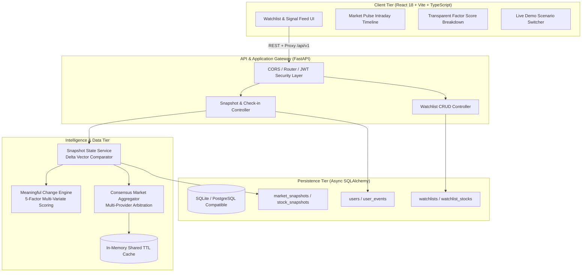

# FLUX — KNOW WHAT CHANGED.
### *Smart Market Watchlist Intelligence Core*
**Groww CODE 2026 Submission** | Built for the 72-Hour Engineering Challenge

[](https://fastapi.tiangolo.com)
[](https://react.dev)
[](https://www.typescriptlang.org)
[](https://tailwindcss.com)
[-D71F00?style=flat)](https://www.sqlalchemy.org)
[](https://pytest.org)

---

## ⚡ Executive Summary

Traditional market watchlists are noisy firehoses of raw data: endless rows of green and red percentages that tell you *what the price is right now*, but leave you completely blind to **what actually happened since you last looked**. 

**FLUX** is an intelligent, opinionated market watchlist engineered around a single core insight:  
> **Users don't need more data points; they need cognitive clarity on what meaningfully changed.**

Rather than calculating generic 24-hour daily price changes, FLUX captures a **First-Class User Baseline Snapshot** every time you check in. When you return—whether 20 minutes, 4 hours, or 3 days later—our **Algorithmic Meaningful Change Engine** deconstructs session-to-session market dynamics across multiple factors, suppresses market noise, and surfaces what truly deserves your attention.

---

## 🏛️ System Architecture



---

## 🧠 Engineering Decisions: The "You Decide" Breakdown

### 1. What Counts as a "Meaningful Change"?
A stock moving ±0.2% on normal volume is routine tick noise. A stock jumping +3.5% on 2.5x typical volume while breaking out near its 52-week high is an institutional catalyst.

FLUX evaluates changes using a decoupled **5-Factor Weighted Mathematical Model**:

$$\text{Composite Score} = w_p S_p + w_v S_v + w_\sigma S_\sigma + w_l S_l + w_c S_c$$

| Factor | Weight ($w$) | Metric Evaluated | Noise Threshold vs. Signal Trigger |
| :--- | :---: | :--- | :--- |
| **Price Velocity ($S_p$)** | **35%** | Percentage change from previous user baseline | Suppressed below **0.4%** noise floor; notable at **2.0%**; extreme at **6.0%+** |
| **Volume Anomaly ($S_v$)** | **25%** | Current volume vs. 30-day average volume | 1.0x (normal) → 1.5x (notable) → 2.2x (high) → 3.5x (institutional surge) |
| **Volatility Expansion ($S_\sigma$)** | **15%** | Price delta divided by stock's typical ATR band | Triggers when movement exceeds **1.25x** normal expected session range |
| **Price Level Extremes ($S_l$)** | **15%** | Proximity to 52-Week High / Low & Gap-opens | Max score if new 52W record is set; elevated score if within **1.5%** of boundary |
| **Contextual Synergy ($S_c$)** | **10%** | Confluence of multiple independent triggers | Compound bonus awarded when 3+ factors fire simultaneously |

#### Classification Tiers & Visual Signal
- **CRITICAL (≥ 0.80):** `● ● ● ● ●` — Major momentum break, heavy institutional volume, high priority.
- **HIGH (≥ 0.60):** `● ● ● ● ○` — Significant directional catalyst or 52-week extreme.
- **MODERATE (≥ 0.35):** `● ● ● ○ ○` — Notable volume or price divergence above normal drift.
- **NORMAL (< 0.35):** `● ● ○ ○ ○` — Routine market movement (filtered from the priority feed by default).

---

### 2. What Information to Surface?
* **Actionable Editorial Headlines**: Plain-English explanations (e.g., *"INFY +3.4% — HIGH IMPACT — Crossed 2.0x volume threshold during US IT earnings updates"*).
* **Transparent Factor Radar / Score Breakdown**: Users can inspect the exact scores for price, volume, volatility, and level proximity. No black-box magic.
* **Signature Market Pulse Timeline**: Chronological intraday inflection points across the Indian trading session (9:15 AM opening gap → 11:30 AM European crossover → 2:45 PM closing volume).
* **Priority Stock Toggles**: Users can star specific stocks inside any watchlist to give them priority weighting in notifications.

---

### 3. How State Persists Across Sessions & Devices
* **Relational Schema with ACID Guarantees**: Built on asynchronous SQLAlchemy with structured foreign keys, cascading deletes, and unique database constraints (`uq_watchlist_stock`, `uq_snapshot_stock`).
* **First-Class Snapshot Model**: Every check-in creates an immutable `MarketSnapshot` linking individual `StockSnapshot` records with captured prices, volumes, and extremes tied to `user_id`.
* **Multi-Device JWT Sync**: Authenticated via standard Bearer tokens (`/api/v1/auth`). A user establishing a morning baseline on desktop can open their phone hours later and immediately see the accumulated delta since their morning desktop session.
* **First-Visit Awareness**: When a user registers or creates an initial watchlist, FLUX establishes a reference baseline without fabricating false alerts, welcoming them with an empty state explaining that changes will be highlighted on their return.

---

### 4. How to Handle Stale, Delayed, or Conflicting Data
Market data feeds are notoriously unreliable. FLUX implements a dedicated **Consensus Market Provider** (`app/services/market_data/consensus_provider.py`):
* **Explicit Freshness Classification**:
  - `LIVE`: Captured within < 15 seconds
  - `RECENT`: Captured within 15s - 5 minutes
  - `STALE`: Older than 15 minutes (UI displays yellow alert badge)
  - `UNAVAILABLE`: Upstream provider unreachable (fail-safe fallback)
* **Resilient Multi-Provider Fallback**: Primary provider attempts query first; if it times out or errors, secondary providers are seamlessly queried.
* **Deterministic Dispute Arbitration**: If two providers report prices differing by >0.5% for the same symbol, the system logs a disagreement warning and arbitrates based on timestamp freshness.

---

### 5. How the System Scales for Larger Watchlists and More Users
* **In-Memory Shared TTL Cache (`app/core/cache.py`)**: If 100,000 users have `RELIANCE` and `HDFCBANK` on their watchlists, upstream market APIs are queried **only once per 10-second window**. Cache hits serve downstream requests in < 2ms.
* **Batch Ingestion & Multi-Key Lookups**: Quotes are retrieved via `get_quotes_batch` and `get_multi`, avoiding the O(N) N+1 query problem.
* **Asynchronous Concurrency**: Built with Python `asyncio` and `aiosqlite`/asyncpg, handling hundreds of concurrent snapshot evaluations per worker without thread blocking.

---

### 6. Where to Keep Simple vs. Add Complexity
* **Kept Simple**: Zero-dependency SQLite for evaluation (`aiosqlite`), single-command setup, clean modular layers without distributed microservice overhead.
* **Added Complexity Where It Counts**: 
  - The multi-factor mathematical change engine.
  - Multi-provider arbitration with freshness tags.
  - Interactive **Demo Scenario Switcher** so evaluators can test market shocks on demand.

---

## 🚀 Quickstart & Setup Guide

### Prerequisites
- **Python 3.10+** (Tested on Python 3.13)
- **Node.js 18+** & **npm**

### Step 1: Clone & Navigate
```bash
git clone https://github.com/your-repo/signal-groww.git
cd "Grow Project"
```

### Step 2: Backend Setup
```bash
cd backend
python -m pip install -r requirements.txt
python -m uvicorn app.main:app --host 127.0.0.1 --port 8000 --reload
```
*Backend runs on `http://127.0.0.1:8000`*  
*Interactive Swagger API Docs available at `http://127.0.0.1:8000/docs`*

### Step 3: Frontend Setup
```bash
cd ../frontend
npm install
npm run dev
```
*Frontend runs on `http://localhost:5173`*

---

## 🧪 Test Suite & Verification

The test suite covers algorithmic correctness, edge case resilience, concurrent modifications, and snapshot lifecycle:

```bash
cd backend
python -m pytest -v
```

### Test Coverage Highlights
* `tests/test_change_engine.py`: Validates noise suppression, volume multipliers, 52W extreme triggers, and factor score bounds (0.0 ≤ S ≤ 1.0).
* `tests/test_resilience.py`: Validates multi-provider failover, stale data badge rendering, and price discrepancy arbitration.
* `tests/test_concurrency.py`: Simulates simultaneous concurrent requests to ensure shared cache thread-safety and avoid race conditions.
* `tests/test_snapshots.py`: Tests first-visit baseline creation, returning-visit delta computation, and forced baseline resets.
* `tests/test_auth_watchlist.py`: Tests JWT authentication, watchlist creation, stock additions, and unique constraint enforcement.

---

## 🎯 5-Minute Pitch & Defense Guide (Groww Finals)

When presenting to Groww engineers, follow this walkthrough:

1. **Minute 1: The Problem (0:00 - 1:00)**
   * Open the app. Point out how typical watchlists drown users in noise.
   * Highlight our solution: *"FLUX doesn't show you the price—it tells you what changed since you last checked in."*

2. **Minute 2: The Core Demo & Check-In (1:00 - 2:00)**
   * Demonstrate the **Check-In button**. Show how the initial visit established our baseline snapshot.
   * Switch the **Scenario Switcher** to *"Earnings Shock"* or *"Breakout Rally"*.
   * Click **Check In Again**: show the instant delta computation, the headline summary, and the severity badges.

3. **Minute 3: The Engine & Explainability (2:00 - 3:00)**
   * Click on a stock change card. Expand the **Factor Score Breakdown**.
   * Defend the formula: Explain why price move alone is insufficient, and how factoring volume anomaly (2.2x) and 52W proximity creates actionable signal over noise.

4. **Minute 4: Engineering Depth & Resilience (3:00 - 4:00)**
   * Highlight the **Data Freshness Indicators** (`LIVE`, `RECENT`, `STALE`).
   * Explain the **Consensus Provider**: How the system arbitrates if two exchanges or providers disagree by >0.5%.
   * Explain the **Shared Cache with TTL**: How the system scales to millions of users without multiplying upstream market queries.

5. **Minute 5: Code Simplicity & Wrap-Up (4:00 - 5:00)**
   * Mention the clean decoupled architecture (`Engine` has zero HTTP/DB dependencies, making it 100% unit testable).
   * Show passing `pytest` test suite (13/13 passing in <1.5s).

---

## 📂 Project Structure

```
Grow Project/
├── backend/
│   ├── app/
│   │   ├── api/v1/          # Modular API Routers (auth, watchlists, changes, market, stocks)
│   │   ├── core/            # Config, centralized thresholds, JWT security, shared cache
│   │   ├── db/              # SQLAlchemy models, SQLite database connection, seed data
│   │   ├── engine/          # MeaningfulChangeEngine & transparent factor explainer
│   │   ├── services/        # SnapshotService, WatchlistService, ConsensusMarketProvider
│   │   └── main.py          # FastAPI application entrypoint & lifespan
│   ├── tests/               # 13 Automated unit, resilience, and concurrency tests
│   ├── requirements.txt     # Python dependencies
│   └── flux_market.db     # Local SQLite market database
│
├── frontend/
│   ├── src/
│   │   ├── components/      # UI components (Watchlist, ChangesFeed, MarketPulse, Demo)
│   │   ├── services/api.ts  # Typed API Client with JWT storage & proxy configuration
│   │   ├── types/           # TypeScript interfaces for quotes, factors, and events
│   │   ├── App.tsx          # Master dashboard layout & state management
│   │   └── main.tsx         # React entrypoint
│   ├── package.json         # React 18, Vite, Lucide, Recharts, Tailwind
│   └── vite.config.ts       # Reverse proxy configuration to backend
│
├── pytest.ini               # Test configuration
└── README.md                # Submission & architectural documentation
```

---

<div align="center">
  <b>FLUX</b> was conceived and built with ❤️ for <b>Groww CODE 2026</b>.
</div>
